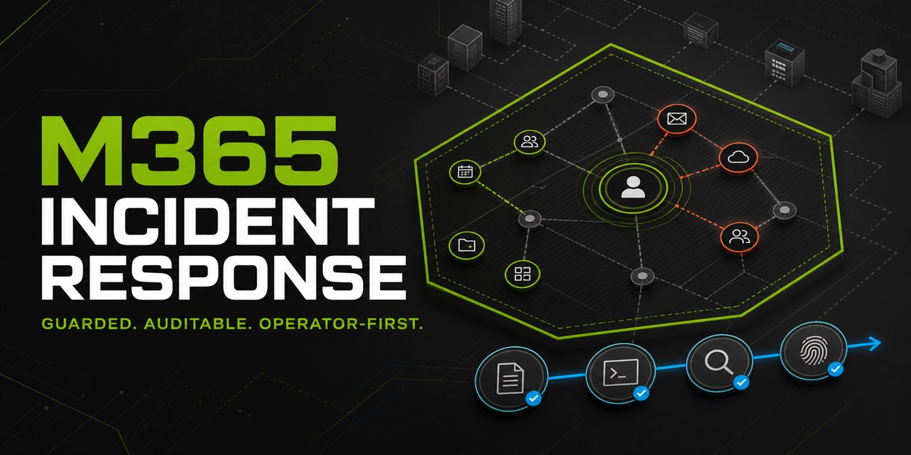

# M365 Incident Response Console

<p align="center">
  
</p>

> Turn a compromised Microsoft 365 identity into a controlled, evidence-backed response without assembling a dozen disconnected scripts.

[](https://github.com/fusiontechstrategies/M365-Incident-Response-Console/actions/workflows/ci.yml)
[](https://github.com/fusiontechstrategies/M365-Incident-Response-Console/actions/workflows/dependency-smoke.yml)
[](https://github.com/PowerShell/PowerShell)
[](LICENSE)

**Start here:** [Download the tested v5.1.0 release asset](https://github.com/fusiontechstrategies/M365-Incident-Response-Console/releases/download/v5.1.0/M365-IR-Console.ps1) · [Read the release notes](https://github.com/fusiontechstrategies/M365-Incident-Response-Console/releases/tag/v5.1.0) · [Preview a sanitized case report](examples/sanitized-case-report.md) · [Follow the safe lab guide](docs/lab-evaluation.md)

M365 Incident Response Console is a one-file PowerShell application for Microsoft 365 investigation, guarded containment, forensic collection, remediation, and evidence integrity. It brings Microsoft Graph, Exchange Online, Purview, Teams, SharePoint, and local case handling into one interactive workflow.

The application starts in **Audit mode**. Audit mode blocks every tenant mutation and replaces reviewed Microsoft Graph write scopes with read-only scopes. **Live mode** must be selected explicitly, and every tenant-changing operation passes through a common gateway with `ShouldProcess`, an exact typed confirmation, and durable case logging.

## Why this is different

- **One executable file:** Copy `M365-IR-Console.ps1` to an approved administrative workstation and run it from PowerShell 7.6 or later.
- **Evidence before action:** Every case receives a chained JSONL action log, SHA-256 evidence manifests, portable exports, and a human-readable case report.
- **Safe by default:** Audit mode cannot execute tenant-changing scriptblocks and will not request a Microsoft Graph write scope.
- **Explicit containment:** Live changes require a case, durable approval logging, `ShouldProcess`, and an operation-specific confirmation phrase.
- **Honest collection:** Query ceilings, repeated pages, partial delivery, retention boundaries, and unavailable licensed features are reported instead of being presented as complete results.
- **Current dependencies:** Module baselines are validated weekly against the PowerShell Gallery and imported in an isolated smoke-test workflow.

## Capability map

| Area | Included workflows |
| --- | --- |
| Identity containment | Revoke sessions, reset a password, block or restore sign-in, review Conditional Access, create and remove console-managed targeted MFA policies |
| Mail investigation | Message Trace V2 with documented cursor handling, sender and recipient analysis, phishing spread review, per-recipient warning delivery status |
| Mailbox persistence | Mailbox snapshot, inbox rules, forwarding, delegation, folder permissions, transport rules, mailbox applications, mobile-device partnerships |
| Audit and risk | Unified Audit Log collection, normalized event timelines, conservative findings, sign-in logs, risky-user status, authentication methods |
| Application access | Delegated OAuth grants, app-role assignments, service-principal enrichment, guarded grant removal |
| Collaboration | Teams membership and channel inventory, SharePoint site access review, selected file-access context |
| Threat analysis | Defender for Office 365 mail detections, message heuristics, protected-domain similarity checks, threat-hunting query files |
| Purview | Create, start, inspect, and remove content-search definitions with explicit live-mode controls |
| Security policy | Policy snapshots and backups, blocked senders, anti-phish settings, outbound-spam review, quarantine rules, Conditional Access reporting and baselines |
| Evidence | Private case directories, chained action log, HTML report, normalized CSV and JSON exports, analyst import package, SHA-256 manifest, protected ZIP archive |

## Safety model

| Control | Audit mode | Live mode |
| --- | --- | --- |
| Default startup state | Yes | No |
| Microsoft Graph write scopes | Replaced with reviewed read-only scopes | Requested only by the selected operation |
| Tenant-changing operation | Blocked before the operation scriptblock executes | Allowed only through `Invoke-IRChange` |
| `-WhatIf` support | Available | Available |
| Exact typed confirmation | Not applicable because no change executes | Required for every production mutation |
| Durable approval record | Planned action recorded when a case exists | Required before execution |
| Completion or failure record | Not applicable | Added to the chained action log |

Returning from Live mode to Audit mode disconnects cached service sessions so a write-capable Graph context is not silently reused.

## Requirements

- PowerShell Core 7.6 or later
- A Microsoft 365 account authorized for the investigation or response action
- Administrator consent for requested Microsoft Graph delegated scopes where required
- Appropriate Microsoft Entra, Exchange Online, Purview, Teams, SharePoint, Intune, and Defender roles and licenses for the selected features
- Network access to Microsoft 365 authentication and service endpoints

The console does not contain real credentials, tenant identifiers, customer names, or API keys. Authentication is handled by the official Microsoft modules.

### Compatibility status

| Environment | Current status |
| --- | --- |
| Windows with PowerShell 7.6+ | Recommended operator environment; the complete offline suite runs in CI on current Windows runners |
| Ubuntu with PowerShell 7.6+ | The complete offline suite runs in CI; individual Microsoft service modules can impose additional platform limitations |
| macOS | Not currently exercised in CI; no live-service compatibility claim is made |
| Windows PowerShell 5.1 or PowerShell earlier than 7.6 | Unsupported and blocked by the script's runtime requirement |

Automated validation never authenticates to a tenant. Live-service behavior remains dependent on the official Microsoft modules, the tenant's licenses and configuration, and the operator's delegated roles. Evaluate the exact workflows you plan to use in an approved test tenant before production use.

### Current module baselines

These versions were verified against the PowerShell Gallery on August 20, 2026.

| Module family | Minimum version | Use |
| --- | ---: | --- |
| `ExchangeOnlineManagement` | `3.10.1` | Exchange Online and Microsoft Purview |
| Microsoft Graph submodules | `2.39.0` | Authentication, users, identity, applications, reports, groups, and devices |
| `MicrosoftTeams` | `7.9.0` | Optional Teams collection |
| `Microsoft.Online.SharePoint.PowerShell` | `16.0.27515.12000` | Optional SharePoint collection |

Use `-InstallMissingModules` only after reviewing your organization's module-management policy. Installation is limited to the current user and the PowerShell Gallery.

## Quick start

Open PowerShell 7.6 or later, then copy and paste this block. It downloads the versioned v5.1.0 release asset and refuses to continue if its SHA-256 digest differs from the digest published by GitHub for that asset.

```powershell
$releaseUri = 'https://github.com/fusiontechstrategies/M365-Incident-Response-Console/releases/download/v5.1.0/M365-IR-Console.ps1'
$expectedSha256 = '0092D181A7EE0383D9F3C9B45CC55FAC583B2029CB168D59A3EB546DD0BE207A'
$destination = Join-Path -Path (Get-Location) -ChildPath 'M365-IR-Console.ps1'
$download = "$destination.download"

if ((Test-Path -LiteralPath $destination) -or (Test-Path -LiteralPath $download)) {
    throw 'A destination or partial download already exists. Use an empty directory or move that file before continuing.'
}
Invoke-WebRequest -Uri $releaseUri -OutFile $download
$actualSha256 = (Get-FileHash -LiteralPath $download -Algorithm SHA256).Hash
if ($actualSha256 -cne $expectedSha256) {
    Remove-Item -LiteralPath $download -Force
    throw "Release digest mismatch. Expected $expectedSha256; received $actualSha256."
}
Move-Item -LiteralPath $download -Destination $destination
"Verified release asset: $destination"
```

Review the downloaded script according to your organization's software-intake process. Then run the local self-test and non-authenticated preflight before connecting to a tenant:

```powershell
pwsh -NoProfile -File .\M365-IR-Console.ps1 -OfflineSelfTest
pwsh -NoProfile -File .\M365-IR-Console.ps1 -PreflightOnly
```

The current release asset is not Authenticode-signed. The digest check above verifies the exact GitHub release asset; it does not establish publisher identity through a code-signing certificate. If organizational policy requires signed PowerShell, do not weaken execution policy. Use your approved internal signing process or wait for a signed release.

For the first tenant-connected run, use a lab tenant and remain in the default Audit mode:

```powershell
pwsh -NoProfile -File .\M365-IR-Console.ps1 `
    -UserPrincipalName analyst-test@contoso.example `
    -Days 30
```

The example address is intentionally non-routable; replace it only with an approved test identity. Do not switch to Live mode during initial evaluation. The [safe lab evaluation guide](docs/lab-evaluation.md) covers roles, permissions, output handling, and change controls.

Install missing current-user modules only after reviewing your module-management policy:

```powershell
pwsh -NoProfile -File .\M365-IR-Console.ps1 -InstallMissingModules
```

Use device-code authentication on a headless workstation or when an embedded
browser cannot be displayed:

```powershell
pwsh -File .\M365-IR-Console.ps1 `
    -UserPrincipalName user@contoso.com `
    -UseDeviceAuthentication
```

The built-in startup, online preflight, and comprehensive collection workflows
connect Exchange Online before Microsoft Graph. The current verified module
baselines bundle different Microsoft Authentication Library versions, and this
order avoids the known Graph-first assembly collision. If Graph was connected
manually before Exchange in the same process and Exchange authentication fails
with an assembly-version error, start a fresh PowerShell process and connect
Exchange first, or isolate the two service collections in separate processes.

Run the non-authenticated prerequisite report:

```powershell
pwsh -File .\M365-IR-Console.ps1 -PreflightOnly
```

No PowerShell Gallery package has been published. The repository's 5.1.1 candidate now includes valid Gallery metadata and isolated modern plus legacy package-consumer tests, but v5.1.0 remains the current public release. See the [Gallery release-readiness record](docs/powershell-gallery.md) for the verified package path and remaining signing, account, tenant, and publication gates.

## Case output

The default case root is outside the repository:

- Windows: `%LOCALAPPDATA%\M365-IR-Console\Cases`
- Linux and macOS: `$XDG_STATE_HOME/m365-ir-console/cases`, or `~/.local/state/m365-ir-console/cases`

New case directories are restricted to the current operating-system identity when the platform supports it. Use `-PreserveInheritedCasePermissions` only after reviewing the destination permissions.

A case can contain:

- `case_metadata.json`
- `action_log.jsonl` with sequence numbers and SHA-256 hash chaining
- Raw and normalized CSV, JSON, and CLIXML exports
- An HTML case report
- Threat-hunting query files
- A portable analyst import package
- `evidence_manifest.sha256.json` and `evidence_manifest.sha256.csv`
- A protected ZIP archive and returned SHA-256 digest

The [sanitized sample report](examples/sanitized-case-report.md) and its [machine-readable fixture](examples/sanitized-case-summary.json) show the decision-focused output without containing tenant data or representing a real incident.

The hash chain and manifest provide tamper evidence. They do not replace organizational evidence-handling procedures, trusted timestamps, digital signatures, or chain-of-custody requirements.

## Microsoft Graph scopes

The console requests delegated scopes as individual workflows need them. Common read scopes include:

- `User.Read.All`
- `Policy.Read.All`
- `AuditLog.Read.All`
- `IdentityRiskyUser.Read.All`
- `UserAuthenticationMethod.Read.All`
- `Application.Read.All`
- `DelegatedPermissionGrant.Read.All`
- `AppRoleAssignment.Read.All`
- `DeviceManagementManagedDevices.Read.All`
- `GroupMember.Read.All`
- `RoleManagement.Read.Directory`

Live response operations can request write scopes such as `User.RevokeSessions.All`, `User-PasswordProfile.ReadWrite.All`, `User.ReadWrite.All`, `Policy.ReadWrite.ConditionalAccess`, `Mail.Send`, `DelegatedPermissionGrant.ReadWrite.All`, `AppRoleAssignment.ReadWrite.All`, and `DeviceManagementManagedDevices.ReadWrite.All`.

Audit mode replaces each reviewed write scope with a read-only alternative. An unreviewed write scope causes a closed failure instead of being requested.

## Operational boundaries

- Message Trace V2 retains up to 90 days, accepts no more than 10 days per query, returns at most 5,000 rows per request, and is subject to service throttling. The console divides the period into service-compliant windows and records incomplete results.
- Defender mail-detail collection is limited to the service's supported period and record ceiling.
- Unified Audit Log retention, result availability, and record fields depend on licensing, configuration, workload, and assigned roles.
- Sign-in logs, risky-user data, Intune inventory, Safe Links, Safe Attachments, and other premium workloads may be unavailable when the tenant lacks the corresponding license, enabled service, or administrative role. The console reports those conditions as unavailable or not applicable instead of treating them as product failures.
- Console-managed MFA policy expiration is recorded as metadata. Review and remove expired policies through the console instead of assuming automatic deletion.
- Heuristic findings are analyst leads, not determinations of compromise.
- Live actions can disrupt accounts, mail flow, applications, devices, or access. Use an approved change and incident process.

## Current source validation

The current source tree is validated with:

- 22 deterministic built-in offline self-tests
- 55 Pester 6.1.0 regression tests
- PowerShell parser validation
- PSScriptAnalyzer 1.25.0 with zero warning or error findings
- Mutation-gateway and exact-confirmation AST checks
- Windows ACL and Unix permission tests
- Microsoft Graph scope downgrade tests
- HTTP throttling and retry tests
- Message-trace and Unified Audit Log paging tests
- Action-log and evidence-manifest tamper tests
- Import tests for all 13 current Microsoft module baselines
- Gitleaks scans of the release tree and Git history
- GitHub Actions testing on current Windows and Ubuntu runners
- A weekly current-dependency import and command-contract smoke test
- Synthetic demo-fixture validation

All automated tests are non-destructive and do not authenticate to a tenant.


## Contributing and security

Read [CONTRIBUTING.md](CONTRIBUTING.md) before proposing changes. The application must remain a one-file executable script, although tests, workflows, and documentation remain separate.

Do not open a public issue for a vulnerability or suspected secret exposure. Follow [SECURITY.md](SECURITY.md) and use GitHub private vulnerability reporting.

## License

Released under the [MIT License](LICENSE).
